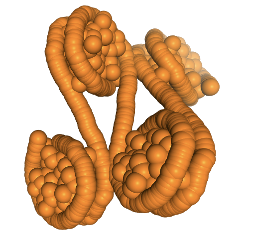

# PYthon Nucleic Acid MODeller

The aim of this project is to provide a set of python tools to perform modelling of:

- DNA fibers
- Protein-DNA complexes based on a set of distances



### Installation

```
conda env create -f environment.yml
conda activate pynamod
pip install -e .
```
