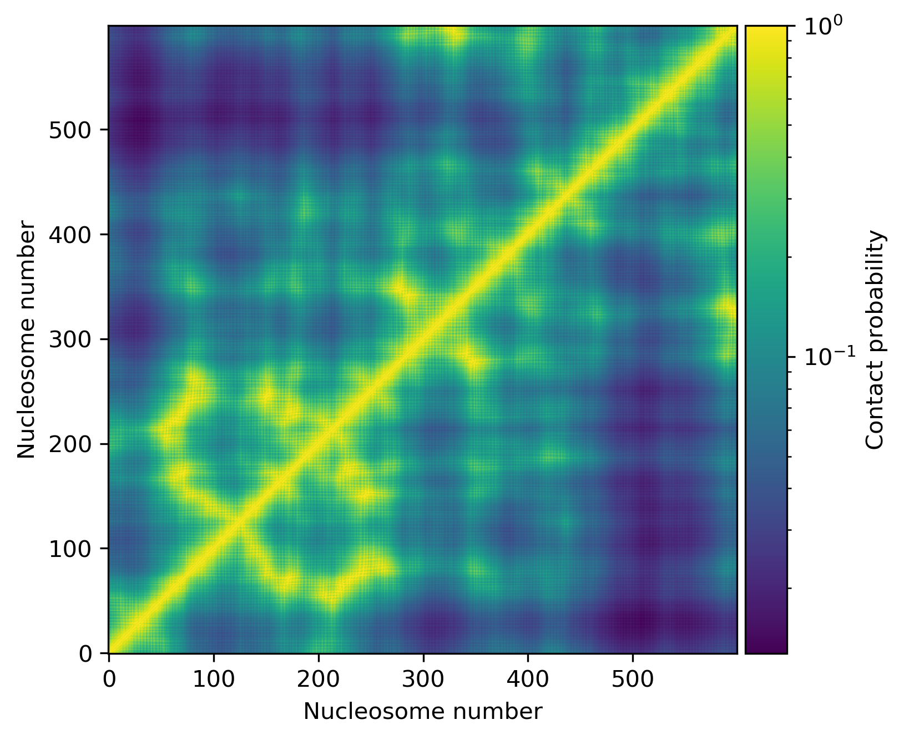

### Iteractive demo for chromatin fiber models

Моделирование фибрилл происходит в параметрах "шагов" динуклеотидов:

В таком наборе параметров по шаблону нуклеосом можно собирвать хроматиновые фибриллы и вычислять карты контактов между нуклеосомами.

Внешний вид фибриллы:

Карта контактов, между нуклеосомами, для данной фибриллы:

[Стохастическое сворачивание нуклеосомной фибриллы](fiber_collapse.md)